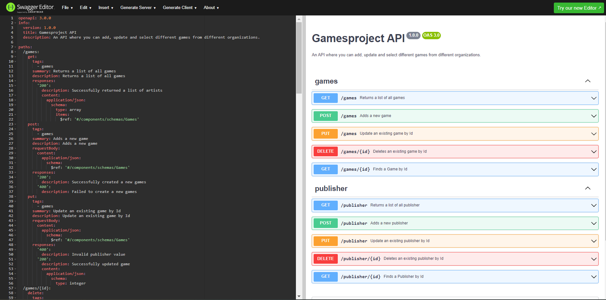

# Gamesproject M295

It is highly recommended to read this Readme to help set up the whole project.

## Database Setup

This code creates and two tables for the games and publishers.
```
create database if not exists gamesproject;

use gamesproject;

create table if not exists publisher (
id int not null primary key,
publishername varchar(245)
);

create table if not exists games (
id int not null primary key,
gamename varchar(245),
publisher_id int,
releasedate date,
platform varchar(95),
foreign key (publisher_id) references publisher(id)
);
```
### Web Security
This one creates the two tables users and authorities, to keep the passwords for the web security safe.

``` 
use gamesproject;

create table if not exists users(
username varchar(50) not null primary key,
password varchar(500) not null,
enabled boolean not null
);

create table if not exists authorities (
username varchar(50) not null,
authority varchar(50) not null,
constraint fk_authorities_users foreign key(username) references users(username)
);
create unique index ix_auth_username on authorities (username,authority);
```

***Important!***
> The _GET_ operation is the only one that isn't authenticated. All the other ones are. This project uses basic authentication.  
> Password: admin  
> Username: admin


## Spring Boot Setup

In the `application.properties` file under _src/main/resources_ you probably need to change these two properties:
``` 
spring.datasource.username= <db username>
spring.datasource.password= <db password>
```

## OpenApi Specification

Put the code from [restapi.yaml](src/main/resources/restapi.yaml) into the [swagger editor](https://editor.swagger.io/), to see all the different paths and crud operations and what they do. It should look like this:


## Postman Example Requests

### POST
> http://localhost:8080/games
> ```
> {
> "id": 1,
> "gameName": "The legend of Zelda",
> "publisher_id": 2,
> "releaseDate": "2006-05-04",
> "platform": "Nintendo"
> }
> ```

> http://localhost:8080/publisher
> ```
> {
> "id": 1,
> "publisherName": "Nintendo"
> }
> ```


### UPDATE
> http://localhost:8080/games
>```
> {
> "id": 1,
> "gameName": "The legend of Zelda Ocarina of Time",
> "publisher_id": 2,
> "releaseDate": "2006-05-04",
> "platform": "Nintendo"
> }
> ```

> http://localhost:8080/publisher
> ```
> {
> "id": 1,
> "publisherName": "Nintendo Co."
> }
> ```


### GET & DELETE
> http://localhost:8080/games
> > http://localhost:8080/games/1

> http://localhost:8080/publisher
> > http://localhost:8080/publisher/1
